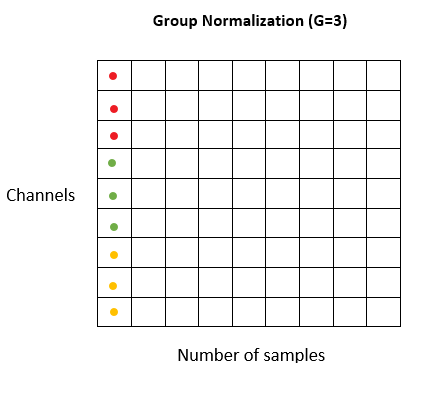
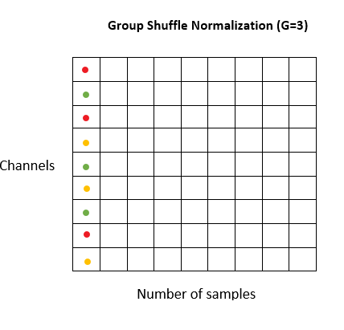
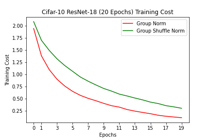
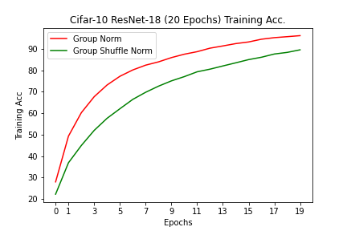
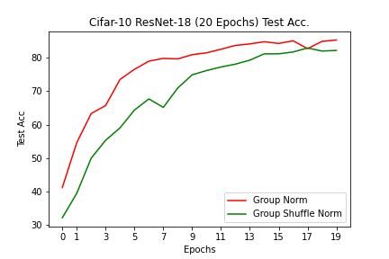

# Group-Normalization
Why Group Normalization works?
## Prerequisites

- PyTorch 1.4+

## Overview

Group Normalization is a normalization technique where channel statistics are computed over a group of channels. Group Norm becomes Layer Norm when all channels are used to compute mean and SD and becomes Instance Norm when only a single channel is used to compute mean and SD. The main claim of Group Norm is that adjacent channels are not independent. 
I wanted to investigate the fact whether Group Norm really takes advantage of adjacent channel statistics. Turns out it does.

## Experiment

To verify the claim I use ResNet-18 for Cifar-10 from <a href = "https://github.com/kuangliu/pytorch-cifar">this repository</a>. 
  
Compared to Vanilla Group Norm on the left, Group Shuffle Norm(right) picks channels that are not adjacent to each other. So a particular group consists of channels which are not adjacent to each other.

## Setup

- Batch-Size = 128
- Step Size = 0.001
- Number of Groups = 32 (for both Group Norm and Group Shuffle Norm)

## Results
| Model   | Train Acc. | Test Acc.  |
| ------- | ---------- | ---------  |
| Group Normalization | 96.17% | 85.38% |  
| Group Shuffle Normalization| 90.38% | 82.36% |

  
Hence Group Norm takes advantage of nearby channels which in-turn gives better results.

## References

- <a href = "https://arxiv.org/pdf/1803.08494.pdf">Group Normalization</a>
